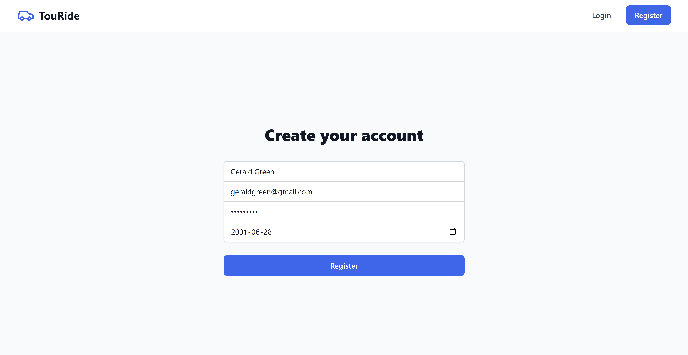
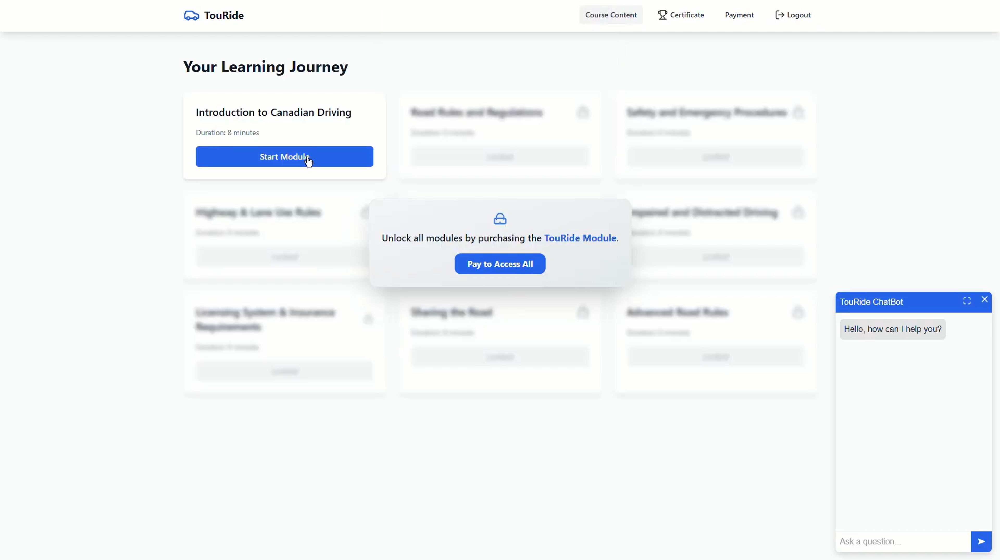
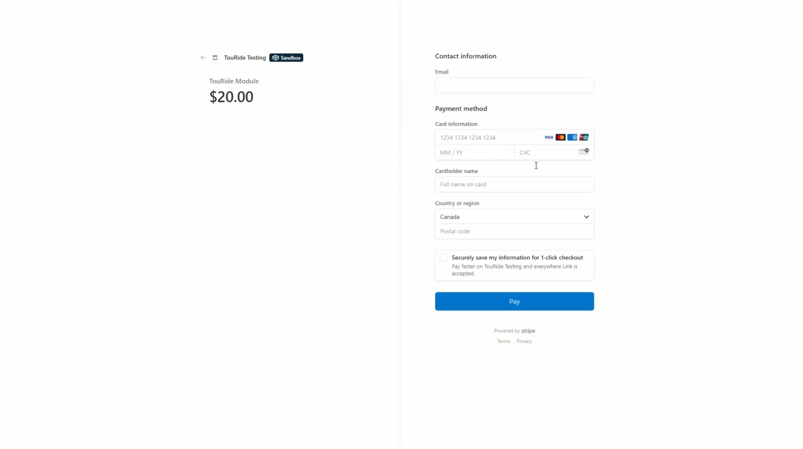
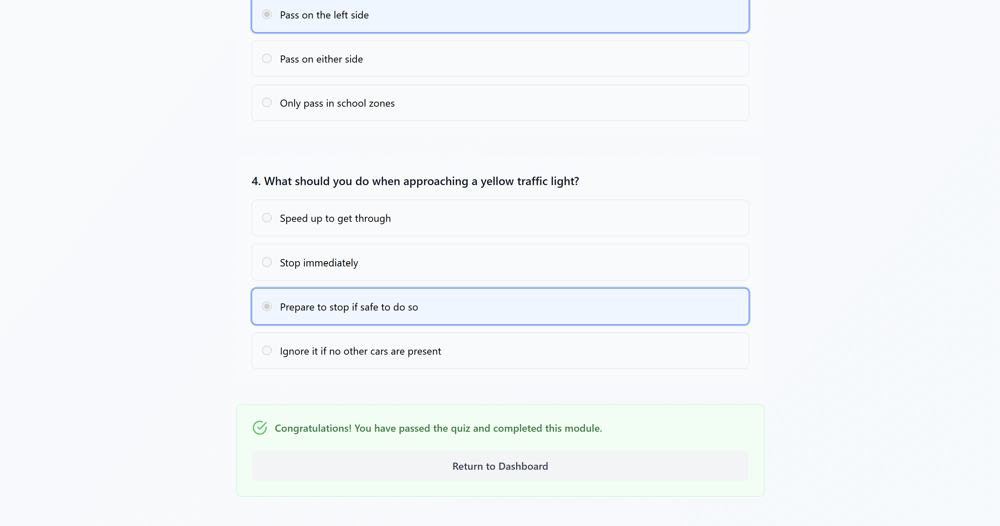

# TouRide

**Your Road to Ontario, Canada Starts Here.**

TouRide is an educational web platform designed to help **tourists**, **new immigrants**, and **international visitors** understand and comply with Ontario’s traffic laws. Through a guided course experience, users can earn an **MTO-verified certificate** that can qualify them for **insurance discounts**, **rental benefits**, and **safer driving habits** in Canada.

---

## 🌐 Take a Look For Yourself!

> Link: https://aaronsiby15.github.io/TouRide2025/

---

## 📚 Key Features

- 🛣 **Interactive Course Modules** on Ontario road signs, right-of-way, special circumstances, and driver etiquette presented in a modern manner.
- 📜 **Certificate of Completion** generated alongside a unique key to be presented to partnering insurance companies and rental agencies.
- 📊 **User Progress Tracking** via Supabase (PostgreSQL backend).
- 🔒 **Secure Login System** with age requirement implementation.
- 💳 **Stripe Payment Integration** to unlock all modules and certificate access.
- 🤖 **AI Chatbot Support** implemented to answer user questions about the course and Ontario driving laws in general.
- 📱 **Responsive Web App** built using modern frameworks for desktop and mobile.

---

## Webapp Screenshots!

### Main Menu GIF


### Create Account Page


### Course Modules Page


### Payment Page


### Module Content


### Module Quiz


### Certificate Page


---

## 💼 Who Is It For?

- ✈️ **Tourists** renting a car for a road trip.
- 🌍 **Newcomers** learning Canadian traffic rules for the first time.
- 📦 **Immigrants** converting their international licenses to G1/G2/G.
- 🎓 **ESL students** or newcomers in driving prep programs.

---

## 🛠 Tech Stack

| Tech             | Purpose                                |
|------------------|----------------------------------------|
| **TypeScript**   | Strongly typed scripting (frontend/backend) |
| **React**        | Frontend UI                            |
| **Supabase**     | Auth, Database (PostgreSQL), Analytics |
| **Tailwind CSS** | Modern, utility-first styling          |
| **Node.js**      | Server-side logic                      |
| **Stripe**       | Secure payment processing              |
| **SQL**          | Custom queries and reports             |

---

## 🧱 MVP Structure

- **Home Page** – Introduction and navigation to the course (with animated scrolling).
- **Login Page** – Secure user authentication.
- **About Page** – Our mission, vision, and how TouRide helps.
- **Content Page** – Modular lessons on Ontario traffic laws.
- **Dashboard** – Tracks course progress and generates certificates.

---

## 🧩 Planned Add-ons

- 🎥 **Video Lessons** with voiceover and subtitles.
- 📊 **Admin Dashboard** for deeper analytics and system management.
- 🌐 **Multilingual Support** for inclusivity.

---

## 🔐 Security & Privacy

- Supabase Authentication ensures all data is secure.
- Stripe handles payments with industry-standard encryption and PCI compliance.
- No third-party data shared.

---

## Copyright (c) 2025 Ameerz

This repostiory is intended for demonstration and educational purposes only. 
You may view the code, but you may not copy, modify, distribute, or use 
any part of this project in your own work without explicit permission.

---

## 🧑‍💻 Accessing (For Developers)

```bash
# 1. Clone the repo
git clone https://github.com/your-org/touride.git
cd touride

# 2. Install dependencies
npm install

# 3. Add environment variables
cp .env.example .env
# Add your Supabase and Stripe credentials

# 4. Start the development server
npm run dev


